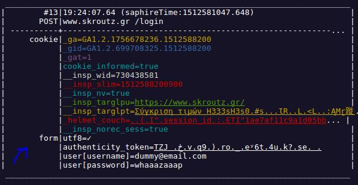
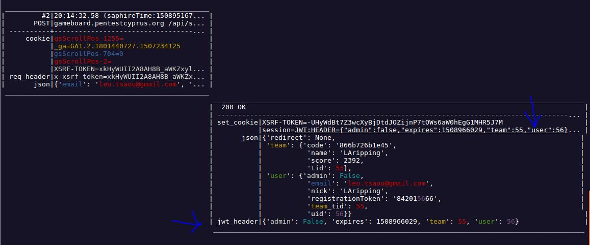
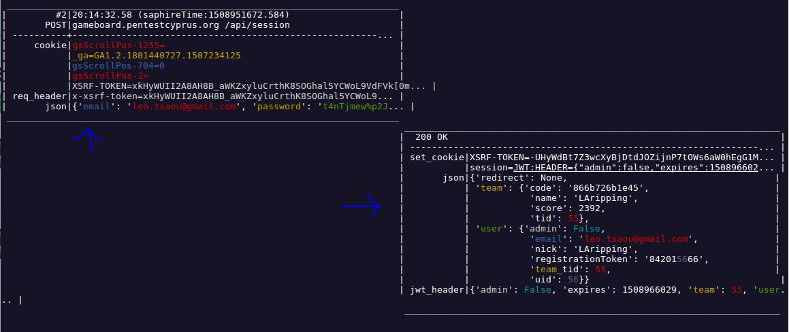
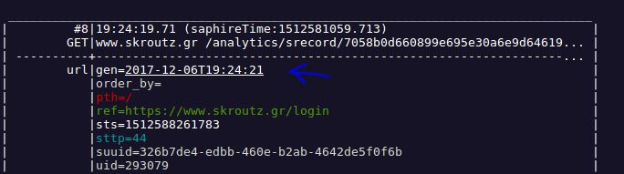

# S A P h I R E

_**S**imple **API** **R**everse **E**ngineering **h**elper_


## Rationale

S A P h I R E is a tool to assist reverse engineering of arbitrary API flows seen in the wild. Flows like Authentication protocols which are often proprietary, undocumented and stuffed with minified JS rendering them completely obfuscated.

It Isolates "tokens" like 

* Cookies
* Headers
* URL parameters
* HTML input tags
* Form fields in requests
* JSON in responses

...and highlight them to make the underlying logic obvious. 


## Screenshots

|  |     |
| :--------------------------------------: | :--------------------------------------: |
|  |  |


## Selling Points

- [x] **Auto-decodes tokens** when type is recognized, to spare the reverser of the easy but tiring chore to manually do it on every occurrence. Types supported by *Smart Decoder*:
    * URL-encoding (*bonus: Full Unicode Support*)
    * Base64 encoding (recognition considering various heuristics)
    * JWT decoding and parsing as tokens
    * timestamps
- [x] **Ignores standard tokens** like [common Headers](/common_headers.txt) (e.g.  `Accept` / `Content-type` ) headers 
- [x] **Filters out irrelevant requests && Ignores media/junk/...** with prompts at runtime.


- [x] **Highlights common tokens** with common colors : The ones *repeated* throughout the (massive) flows

Although in a manual examination, a trained eye will see the business logic being implemented, the volume of data is sometimes too much for a human to connect the dots

*Bonus: Configurable colors*

- [x] **Extracts the flow from the browser**: in HAR files, see Usage below.
      * No need for MITM proxies / network sniffing to capture the flow. 
      * No more certificate installing, pinning-bypasses.


## Installation

```bash
git clone https://github.com/LAripping/SAPhIRE && cd SAPhIRE/
sudo pip install virtualenv
virtualenv saphvenv
source saphvenv/bin/activate
pip install -r requirements.txt
```


## Usage

Go ahead and visit a production site you always wanted to script! First manually carry out the flow (assumed Firefox\*): Open Dev Tools -> `Network` tab -> Check `Persist Logs`, clear it and... -> ( do the flow ) -> Right click -> `Save as HAR`. Then:

<a href="https://asciinema.org/a/YxEnyseHyMsXYtkoxtd3UJfBv?autoplay=1" target="_blank"></a>


\* Other browsers supported, but Firefox is recommended, see FAQ #1


### Options
`-c, --nocolor` No fancy colors and stuff, meaningful only in flow_print mode

`-s, --nosmart` don't attempt any smart decoding. Useful in (rare) cases it messes up

`-i, --interactive` print requests/responses one pair at a time, instead of flooding the terminal

`-x, --expand` Specify how to spread the different tokens of each category (meaningful only in flow_print mode) Possible Values:

* `h` for Horizontal expansion. This will lead to a summarized view focusing more on the flow . like: 

```

 ____________________________________________________________________________________________________________________
|         #4|18:53:43.42                                                                                             |
|        GET|akispetretzikis.com /xtcore.js                                                                          |
| ----------+----------------------------------------------------------------------------------------------------... |
|     cookie|__atuvc=1|48 __atuvs=5a1b0d78ddce9c96000 xtvrn=$568522$ cookies_accept=1 _eproductions.gr_session=BA... |
 ____________________________________________________________________________________________________________________
 

```

* `v` for Vertical expansion, *the default view*. Now we see the tokens in detail occupying more screen real estate per-request. 

```
 _____________________________________________________________________
|       #160|20:15:48.27                                              |
|        GET|cdn.syndication.twimg.com /widgets/timelines/44954441... |
| ----------+-----------------------------------------------------... |
|        url|callback=__twttr.callbacks.tl_i0_449544415724326914_o... |
|           |dnt=false                                                |
|           |domain=akispetretzikis.com                               |
|           |lang=en                                                  |
|           |suppress_response_codes=true                             |
|           |t=1679889                                                |
|           |tz=GMT+0200                                              |
|     cookie|lang=en                                                  |
 _____________________________________________________________________
                                                                       __________________________________________________________________
                                                                      |  200                                                             |
                                                                      | -------------------------------------------------------------... |
                                                                      | rsp_header|x-cache=MISS                                          |
                                                                      |           |x-served-by=cache-tw-par1-2-TWPAR1                    |
                                                                      |           |x-response-time=247                                   |
                                                                      |           |x-timer=S1511900149.759974,VS0,VE258                  |
                                                                      |           |x-connection-hash=c043173fd3fa017e6d127140aa898aa6... |
                                                                       __________________________________________________________________


```


### Config file

For more advanced use-cases, more fine-grained configurations can be specified in the `conf.py` file in the same directory, which is *always* parsed at runtime. Read the file for an explanation of the options (currently and to-be) supported.


## FAQ

1. *I can't extract the HAR file from my browser!*

   Under certain circumstances, when pressing "Save All as HAR" on Firefox's debugger, nothing happens. I have reached the conclusion that this occurs because of **ongoing XHR requests** , and when they are canceled/completed the action can be succesfully repeated. An example of this is [Facebook's HTTP Long Polling](https://stackoverflow.com/questions/2663882/how-does-facebook-chat-avoid-continuous-polling-of-the-server). Stoping the page from loading usually is not an option, and even loading a new page will leave them hanging in the Debugger. Disconnecting from the network won't fix the problem for the same reason, so the only solution is the following:

   * Click the stacktrace of the call (in the request tab) to navigate to the statement responsible
   * Pretty print to better locate it in a single line
   * Add a breakpoint so that execution will pause before even commencing the request
   * Refresh / Repeat the proccess

2. *The sensitive info transferred do not appear in the HAR!* 

   **Use Firefox** to extract the HAR file of the flow. The tool was originally developed and tested with Chrome, but after many indications, I realized it hides important form parameters from HAR files (as well as `curl` dumps). Mozilla Firefox instead revealed everything. For more see Issue #11  
